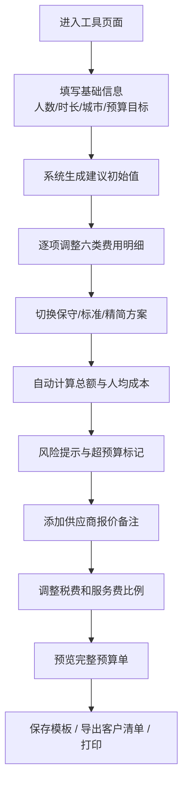

## 1. 产品概述

线下活动预算快速估算工具，面向活动策划人员，提供从基础信息录入到最终预算清单导出的全流程支持。

- 核心目的：帮助活动策划人员在短时间内完成线下活动的预算估算，支持多方案对比和风险识别
- 目标用户：活动策划、市场经理、项目经理、客户对接人员
- 核心价值：提升预算编制效率、降低人为计算错误、提供专业的方案对比、快速生成客户确认文件

## 2. 核心功能

### 2.1 用户角色

| 角色 | 注册方式 | 核心权限 |
|------|---------|---------|
| 活动策划人员 | 无需注册，直接使用 | 完整功能：输入数据、方案切换、导出预算单 |

### 2.2 功能模块

1. **基础信息区**：活动名称、日期、人数、场地时长、城市档位、预算目标
2. **费用明细区**：场地、餐饮、物料、交通、人员、备用金六大类明细录入
3. **方案对比区**：保守/标准/精简三档方案切换与系数调整
4. **风险提示区**：超预算预警、风险项标记、供应商报价备注
5. **调整设置区**：税费比例、服务费比例、模板复制功能
6. **导出预览区**：完整预算单打印、客户简版清单导出、JSON 数据导出

### 2.3 页面详情

| 页面名称 | 模块名称 | 功能描述 |
|---------|---------|---------|
| 主页面 | 基础信息 | 输入活动名称、日期、参与人数、场地时长（小时/天）、城市档位（一线/新一线/二线/三线及以下）、目标总预算 |
| 主页面 | 费用明细-场地 | 场地租赁、布置搭建、设备租赁（音响/灯光/投影），每项含单价、数量、小计 |
| 主页面 | 费用明细-餐饮 | 餐费标准、茶歇、酒水，支持按人头/按桌/按次计费 |
| 主页面 | 费用明细-物料 | 宣传物料、伴手礼、签到用品、鲜花装饰，可添加自定义项 |
| 主页面 | 费用明细-交通 | 接送车辆、物料运输、异地差旅，支持多种交通方式 |
| 主页面 | 费用明细-人员 | 主持人、演艺人员、摄影摄像、礼仪、兼职工作人员 |
| 主页面 | 费用明细-备用金 | 应急备用金比例设置、不可预见费用 |
| 主页面 | 方案对比 | 三档方案切换，每档有预设系数，可查看横向对比表格 |
| 主页面 | 风险提示 | 单项超预算红色高亮，异常值提示，缺漏项提醒 |
| 主页面 | 供应商备注 | 每类费用可添加供应商名称、报价日期、联系电话、备注说明 |
| 主页面 | 模板管理 | 复制上次活动模板、保存当前方案为模板、清空重填 |
| 主页面 | 税费调整 | 增值税率、服务费率自定义输入，自动计算含税总额 |
| 主页面 | 预览区域 | 实时显示人均成本、分类占比饼图、总额汇总 |
| 主页面 | 打印导出 | 打印正式预算单（含公司名称/logo 占位）、导出客户简版 PDF/打印页、导出 JSON 数据 |

## 3. 核心流程

用户进入工具页面 → 填写基础信息（人数、时长、城市档位） → 系统根据城市档位和人数提供初始建议值 → 用户逐项调整六类费用明细 → 切换不同方案查看差异 → 系统自动计算人均成本和总额并标记风险 → 添加供应商备注 → 调整税费和服务费 → 预览完整预算单 → 复制模板或导出客户清单。

## 4. 用户界面设计

### 4.1 设计风格

- **设计方向**：专业商务风 + 数据可视化，参考专业咨询报告风格
- **主色调**：深海军蓝 (#1E3A5F) 作为主色，搭配金铜色 (#C9A962) 作为强调色
- **辅助色**：柔和米白背景 (#FAF8F5)，数据卡片浅灰边框 (#E8E4DE)
- **语义色**：成功绿 (#3A7D44)、警告橙 (#D4923C)、超支红 (#C2464A)
- **按钮样式**：直角微圆角（2px），主按钮深蓝填充配金色边框装饰，次要按钮描边式
- **字体方案**：
  - 标题：Noto Serif SC（宋体风格，专业感）
  - 正文：Noto Sans SC（清晰易读）
  - 数字/金额：JetBrains Mono（等宽字体，对齐整齐）
- **布局风格**：左侧固定导航分栏 + 右侧主内容卡片式布局，顶部状态栏显示实时汇总
- **数据可视化**：分类占比环形图、方案对比柱状图，简洁的 ECharts 风格
- **装饰元素**：细线分隔、优雅的数据卡片阴影、金色顶部分隔条

### 4.2 页面设计概览

| 页面名称 | 模块名称 | UI 元素 |
|---------|---------|--------|
| 主页面 | 顶部汇总栏 | 粘性定位，实时显示总预算、人均成本、方案标签、剩余预算条 |
| 主页面 | 左侧导航 | 六个锚点导航：基础信息、费用明细、方案对比、风险提示、调整设置、导出预览 |
| 主页面 | 基础信息卡片 | 双列表单布局，标签左对齐，下拉选择城市档位，日期选择器 |
| 主页面 | 费用明细卡片组 | 六个可折叠面板，每类费用一个独立卡片，内部表格录入，右侧小计列右对齐 |
| 主页面 | 方案对比 | 三列并排方案卡，当前方案高亮，底部横向对比表格显示差异金额 |
| 主页面 | 风险提示 | 列表式展示，每条带感叹号图标，严重程度分级（红/橙/灰） |
| 主页面 | 供应商备注 | 可展开抽屉/模态框，表单式录入供应商信息 |
| 主页面 | 调整设置 | 滑块 + 数字输入框组合，实时预览税费变化 |
| 主页面 | 导出预览 | 双标签页（完整版/简版），A4 纸张模拟预览，打印样式优化 |
| 主页面 | 分类占比 | 环形饼图，右侧分类金额列表，hover 高亮 |

### 4.3 响应式

- 桌面端优先设计（≥1280px），左侧导航 + 主内容区双栏布局
- 平板端（768-1279px）：左侧导航收起为图标式，主内容全宽
- 移动端（<768px）：顶部标签页切换各模块，卡片纵向堆叠，汇总栏固定在底部
- 触摸优化：按钮最小 44px 高度，数字输入框支持步进器

### 4.4 打印优化

- 专门的 @media print 样式
- 去除导航栏、操作按钮、折叠交互
- 预算单采用标准 A4 尺寸排版
- 页面分页逻辑合理（大类不跨页分割）
- 页眉含活动名称，页脚含页码和日期
