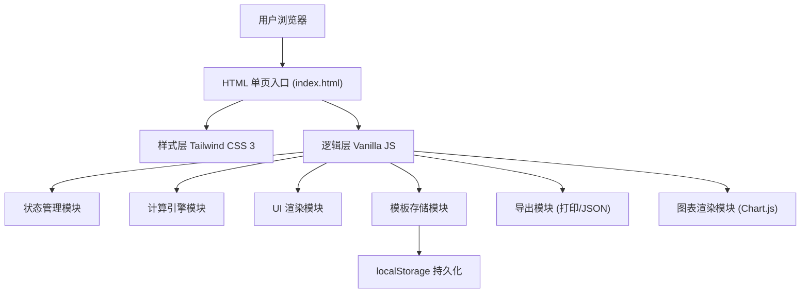

## 1. 架构设计

纯前端单页应用，所有计算逻辑在浏览器端完成，数据使用 localStorage 持久化存储。



## 2. 技术说明

- **前端框架**：Vanilla JavaScript (ES6+)，无需构建步骤，打开即用
- **样式方案**：Tailwind CSS 3（CDN 引入）+ 自定义 CSS 变量
- **图表库**：Chart.js（CDN 引入），用于分类占比环形图和方案对比柱状图
- **初始化方式**：直接在 index.html 中通过 CDN 加载依赖，无需 npm/vite 构建
- **后端**：无，纯前端计算
- **数据存储**：localStorage 存储模板数据，导出时支持 JSON 文件下载
- **字体**：Google Fonts CDN 引入 Noto Serif SC / Noto Sans SC / JetBrains Mono

## 3. 模块划分（单页内区域）

| 模块 ID | 区域名称 | 核心职责 |
|--------|---------|---------|
| #header | 顶部汇总栏 | 实时显示总额、人均、方案、预算进度条 |
| #sidebar | 左侧导航 | 锚点跳转，当前区域高亮 |
| #section-basic | 基础信息 | 人数/时长/城市/目标预算输入 |
| #section-cost | 费用明细 | 六类费用卡片，表格式录入 |
| #section-plan | 方案对比 | 三档方案切换 + 横向对比表 |
| #section-risk | 风险提示 | 超预算/缺漏/异常值列表 |
| #section-adjust | 调整设置 | 税费/服务费/模板操作 |
| #section-export | 导出预览 | A4 模拟预览 + 打印/导出按钮 |

## 4. 数据结构定义

### 4.1 预算主数据 (BudgetData)

```typescript
interface BudgetData {
  // 基础信息
  basic: {
    eventName: string;
    eventDate: string;
    peopleCount: number;     // 参与人数
    durationHours: number;   // 场地时长(小时)
    durationDays: number;    // 场地时长(天)
    cityTier: 't1' | 't1n' | 't2' | 't3';  // 一线/新一线/二线/三线及以下
    targetBudget: number;    // 目标总预算
  };
  // 当前方案
  currentPlan: 'conservative' | 'standard' | 'lean';
  // 费用明细
  costs: {
    venue: CostItem[];       // 场地
    catering: CostItem[];    // 餐饮
    materials: CostItem[];   // 物料
    transport: CostItem[];   // 交通
    personnel: CostItem[];   // 人员
    contingency: CostItem[]; // 备用金
  };
  // 调整项
  adjustments: {
    taxRate: number;         // 增值税率 %
    serviceRate: number;     // 服务费率 %
    contingencyRate: number; // 备用金比例 %
  };
  // 供应商备注
  suppliers: {
    [category: string]: SupplierInfo[];
  };
}

interface CostItem {
  id: string;
  name: string;
  unitPrice: number;
  quantity: number;
  unit: string;             // 元/人, 元/小时, 元/次, 元/桌 等
  remark: string;
  isCustom: boolean;        // 是否自定义项
}

interface SupplierInfo {
  id: string;
  name: string;
  contact: string;
  phone: string;
  quoteDate: string;
  quoteAmount: number;
  notes: string;
  category: string;
}
```

### 4.2 城市档位基础系数

```javascript
const CITY_TIER_MULTIPLIER = {
  t1: 1.4,   // 一线城市
  t1n: 1.2,  // 新一线
  t2: 1.0,   // 二线
  t3: 0.8    // 三线及以下
};
```

### 4.3 方案系数

```javascript
const PLAN_MULTIPLIER = {
  conservative: 1.3,  // 保守
  standard: 1.0,      // 标准
  lean: 0.75          // 精简
};
```

## 5. 核心计算逻辑

### 5.1 单项小计

```
单项小计 = 单价 × 数量 × 城市档位系数 × 方案系数
```

### 5.2 分类合计

```
分类合计 = Σ(该分类下所有单项小计)
```

### 5.3 税前总额

```
税前总额 = 场地合计 + 餐饮合计 + 物料合计 + 交通合计 + 人员合计 + 备用金合计
```

### 5.4 备用金自动计算（可选）

```
备用金建议值 = (前五类合计) × 备用金比例(默认10%)
```

### 5.5 税费和服务费

```
税费 = 税前总额 × 税率
服务费 = 税前总额 × 服务费率
```

### 5.6 最终总额

```
最终总额 = 税前总额 + 税费 + 服务费
人均成本 = 最终总额 / 参与人数
```

### 5.7 风险判定

```
超预算项: 单项小计 / 分类合计 > 行业常规占比区间
缺漏项:   人数>50但缺少某项必要费用（如签到物料、摄像）
异常值:   人均餐饮<30 或 >1000 等偏离正常范围
总额超支: 最终总额 > 目标预算（红色警告）
总额接近: 最终总额 > 目标预算 × 90%（橙色提醒）
```

## 6. 模板存储格式

使用 localStorage key: `event-budget-templates`

```json
{
  "templates": [
    {
      "id": "uuid",
      "name": "模板名称",
      "savedAt": "2026-06-19T06:00:00.000Z",
      "data": { /* BudgetData 完整结构 */ }
    }
  ],
  "lastUsed": "uuid"
}
```
